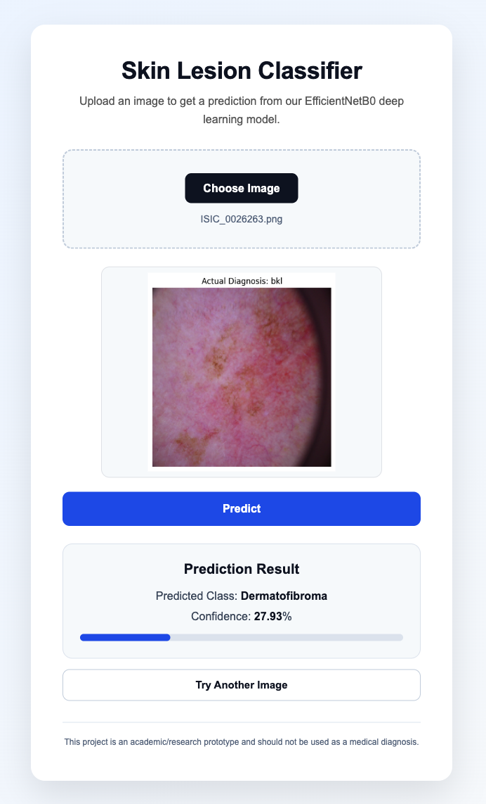

# 🩺 Skin Cancer Lesion Classification Using Deep Learning

A deep learning-based academic project for classifying dermatoscopic skin lesion images into seven diagnostic categories using the **HAM10000 dataset**.

The project evaluates **EfficientNetB0** and **ResNet50** using transfer learning, handles class imbalance with class weights, performs lesion-level data splitting to reduce data leakage, and provides a **Django REST API + web interface** for image prediction.

> ⚠️ **Medical Disclaimer:** This project is an academic/research prototype and is **not a medical diagnostic tool**. Predictions should not be used for clinical decisions.

---

## 🌐 Live Demo

🚀 **Try the deployed application:**

https://skin-cancer-lesion-classification.onrender.com/

Users can upload a skin lesion image and receive a prediction from the deployed EfficientNetB0 model.

---

## 📸 Web Application



The web application provides:

- Image upload
- Image preview
- Prediction using EfficientNetB0
- Human-readable class names
- Confidence percentage
- Confidence progress bar
- Loading indicator
- Try Another Image functionality
- Responsive UI
- Medical disclaimer

---

## 📌 Project Overview

Skin lesion classification is a challenging computer vision problem because different lesion types can have visually similar characteristics and the dataset is highly imbalanced.

This project uses **transfer learning** to classify skin lesion images into seven diagnostic categories.

### Main Objectives

- Train and evaluate EfficientNetB0 and ResNet50.
- Handle severe class imbalance using class weights.
- Perform lesion-level train/validation/test splitting.
- Reduce potential data leakage from multiple images belonging to the same lesion.
- Compare models using accuracy and F1-score.
- Select the best-performing model.
- Convert the trained model to TensorFlow Lite format.
- Use LiteRT for lightweight model inference.
- Build a Django REST API for model inference.
- Build a web interface for image upload and prediction.
- Deploy the complete application on Render.

---

## 🧠 Machine Learning Models

Two ImageNet-pretrained CNN architectures were evaluated.

### EfficientNetB0

- ImageNet pretrained
- Transfer learning
- Global Average Pooling
- Dropout
- 7-class Softmax output
- Selected as the final model

### ResNet50

- ImageNet pretrained
- Transfer learning
- Global Average Pooling
- Dropout
- 7-class Softmax output
- Used as the comparison model

---

## 📊 Dataset

The project uses the **HAM10000 (Human Against Machine with 10000 training images)** dataset.

The dataset contains **10,015 dermatoscopic images** belonging to seven lesion categories.

### Classes

| Code | Diagnosis |
|------|-----------|
| `akiec` | Actinic Keratoses |
| `bcc` | Basal Cell Carcinoma |
| `bkl` | Benign Keratosis-like Lesions |
| `df` | Dermatofibroma |
| `mel` | Melanoma |
| `nv` | Melanocytic Nevi |
| `vasc` | Vascular Lesions |

### Dataset Distribution

| Class | Images |
|------|-------:|
| `nv` | 6705 |
| `mel` | 1113 |
| `bkl` | 1099 |
| `bcc` | 514 |
| `akiec` | 327 |
| `vasc` | 142 |
| `df` | 115 |

The dataset is highly imbalanced, with `nv` representing the majority class.

To reduce the impact of this imbalance, **class weights** were used during model training.

---

## 🔀 Data Splitting

The dataset was split at the **lesion level** rather than randomly splitting individual images.

This is important because multiple images can belong to the same lesion. Splitting at the lesion level helps reduce the possibility of related images appearing in both training and testing datasets.

| Split | Images | Lesions |
|------|-------:|--------:|
| Training | 7,002 | 5,229 |
| Validation | 1,532 | 1,120 |
| Test | 1,481 | 1,121 |

There were **7,470 unique lesions**, and no lesion was found with multiple diagnosis labels.

---

## ⚙️ Image Preprocessing

Images were resized to:

```text
224 × 224
```

Batch size:

```text
32
```

Pixel values were kept in the `0–255` range because the EfficientNetB0 architecture used in the project includes its own preprocessing.

Class weights were applied during model training to address class imbalance.

---

## 📈 Model Performance

### Final Comparison

| Metric | EfficientNetB0 | ResNet50 |
|---|---:|---:|
| Best Validation Accuracy | **66.78%** | 64.88% |
| Best Validation Loss | 0.9501 | **0.9393** |
| Test Accuracy | **66.31%** | 65.63% |
| Macro F1 | **49.03%** | 45.39% |
| Weighted F1 | **69.49%** | 68.89% |

### 🏆 Selected Model

**EfficientNetB0** was selected as the final model because it achieved better:

- Test accuracy
- Macro F1
- Weighted F1

compared with ResNet50.

Although ResNet50 achieved a slightly lower validation loss, EfficientNetB0 provided better overall classification performance on the test set.

---

## 🔍 Example Prediction

The application accepts an image through the web interface and sends it to the Django REST API.

Example API response:

```json
{
    "predicted_class": "df",
    "confidence": 27.93
}
```

The frontend converts the model's class code into a human-readable diagnosis name.

For example:

```text
df → Dermatofibroma
mel → Melanoma
nv → Melanocytic Nevi
bkl → Benign Keratosis-like Lesions
bcc → Basal Cell Carcinoma
akiec → Actinic Keratoses
vasc → Vascular Lesions
```

---

## 🏗️ Application Architecture

```text
                    User
                      │
                      ▼
              Web Interface
              HTML / CSS / JS
                      │
                      │ Image Upload
                      ▼
             Django REST API
                      │
                      ▼
              Image Preprocessing
                224 × 224 RGB
                      │
                      ▼
             EfficientNetB0
                LiteRT Model
                      │
                      ▼
              7-Class Prediction
                      │
                      ▼
             Class + Confidence
                      │
                      ▼
                Web Interface
```

---

## 🔄 Application Workflow

```text
User uploads image
        ↓
Frontend sends image
        ↓
Django REST API
        ↓
Image preprocessing
        ↓
EfficientNetB0 LiteRT model
        ↓
7-class prediction
        ↓
Predicted class + confidence
        ↓
Frontend displays result
```

---

## 🚀 Deployment

The application is deployed using **Render**.

The original Keras model was approximately 29 MB, but loading TensorFlow/Keras directly in the Render environment caused memory limitations.

To make deployment lightweight, the trained model was converted to TensorFlow Lite format and deployed using LiteRT.

```text
Keras Model
     ↓
TensorFlow Lite Conversion
     ↓
final_efficientnetb0.tflite
     ↓
LiteRT Interpreter
     ↓
Django REST API
     ↓
Render
```

The production application uses the lightweight `.tflite` model for inference instead of loading the complete TensorFlow/Keras runtime.

This reduces the memory requirements of the deployed application.

---

## 📦 Model Files

The repository contains:

```text
model/
├── final_efficientnetb0.keras
└── final_efficientnetb0.tflite
```

The `.keras` file is the original trained EfficientNetB0 model.

The `.tflite` file is the lightweight version used for production inference.

Large model files are managed using **Git LFS**.

---

## 🛠️ Technologies Used

### Machine Learning

- Python
- TensorFlow
- Keras
- EfficientNetB0
- ResNet50
- TensorFlow Lite
- LiteRT
- NumPy
- Pandas
- Scikit-learn
- Pillow

### Backend

- Django
- Django REST Framework
- django-cors-headers
- Gunicorn
- WhiteNoise

### Frontend

- HTML5
- CSS3
- JavaScript

### Development & Deployment

- Google Colab
- VS Code
- Git
- GitHub
- Git LFS
- Render

---

## 📁 Project Structure

```text
skin-cancer-lesion-classification/
│
├── README.md
├── Skin_Cancer_Detection.ipynb
├── requirements.txt
├── requirements-render.txt
├── .gitignore
├── .gitattributes
├── manage.py
├── test_prediction.py
│
├── screenshots/
│   └── demo.png
│
├── model/
│   ├── final_efficientnetb0.keras
│   └── final_efficientnetb0.tflite
│
├── backend/
│   ├── __init__.py
│   ├── settings.py
│   ├── urls.py
│   ├── asgi.py
│   └── wsgi.py
│
├── prediction/
│   ├── __init__.py
│   ├── model_loader.py
│   ├── views.py
│   ├── models.py
│   ├── admin.py
│   └── tests.py
│
└── frontend/
    ├── index.html
    ├── style.css
    └── script.js
```

---

## 💻 Running the Project Locally

### 1. Clone the Repository

```bash
git clone https://github.com/sumityadavgh/skin-cancer-lesion-classification.git
```

```bash
cd skin-cancer-lesion-classification
```

### 2. Create a Virtual Environment

Using Python 3.13:

```bash
python3.13 -m venv venv
```

Activate it:

```bash
source venv/bin/activate
```

### 3. Install Dependencies

```bash
pip install -r requirements.txt
```

### 4. Run Django Migrations

```bash
python manage.py migrate
```

### 5. Start the Application

For local development:

```bash
python manage.py runserver --insecure
```

Open:

```text
http://127.0.0.1:8000/
```

The frontend is served directly by Django.

---

## 🔌 API

### Prediction Endpoint

```text
POST /api/predict/
```

Local endpoint:

```text
http://127.0.0.1:8000/api/predict/
```

The API expects an image using the form field:

```text
image
```

### Example Request

```bash
curl -X POST \
  -F "image=@image.jpg" \
  http://127.0.0.1:8000/api/predict/
```

### Example Response

```json
{
    "predicted_class": "nv",
    "confidence": 82.45
}
```

---

## 📓 Project Notebook

The complete machine learning workflow is available in:

```text
Skin_Cancer_Detection.ipynb
```

The notebook contains:

- Dataset loading
- Dataset analysis
- Class distribution
- Lesion-level data splitting
- Image preprocessing
- Class weighting
- EfficientNetB0 training
- EfficientNetB0 fine-tuning
- ResNet50 training
- Model evaluation
- Classification reports
- Confusion matrices
- Training graphs
- Model comparison
- Prediction examples
- Project conclusion
- Limitations
- Future improvements

---

## ⚠️ Limitations

- The dataset is highly imbalanced.
- Some lesion classes contain relatively few samples.
- Visually similar classes can be difficult to distinguish.
- Minority classes have lower predictive performance.
- Overall accuracy does not fully represent performance across all classes.
- The model has not been clinically validated.
- The model may produce unreliable predictions for images outside the HAM10000 distribution.
- The application should not be used to diagnose skin diseases.
- Confidence scores should not be interpreted as clinical certainty.

---

## 🔮 Future Improvements

Possible future improvements include:

- Larger and more diverse datasets
- Stronger data augmentation
- Improved class balancing
- Hyperparameter optimization
- Advanced transfer-learning strategies
- Explainable AI techniques such as Grad-CAM
- Out-of-distribution detection
- Model calibration
- Improved UI/UX
- Clinical validation with appropriate medical datasets
- Expert evaluation of model predictions

---

## 📌 Key Findings

- EfficientNetB0 achieved better overall performance than ResNet50.
- EfficientNetB0 achieved **66.31% test accuracy**.
- EfficientNetB0 achieved **49.03% macro F1**.
- EfficientNetB0 achieved **69.49% weighted F1**.
- Both models performed best on the majority `nv` class.
- Minority classes were more difficult to classify.
- Confusion was observed among visually similar classes such as `nv`, `mel`, and `bkl`.
- Class imbalance remains an important limitation.
- Lightweight LiteRT inference made deployment possible within the available Render memory constraints.

---

## 📄 License

This project is intended for **educational and research purposes**.

The model and application should not be used for medical diagnosis or clinical decision-making.

---

## ⭐ Acknowledgement

This project uses the **HAM10000 dataset** for academic and research purposes.

The project demonstrates the application of transfer learning, deep learning, class-imbalance handling, model evaluation, and lightweight model deployment for multi-class skin lesion classification.
